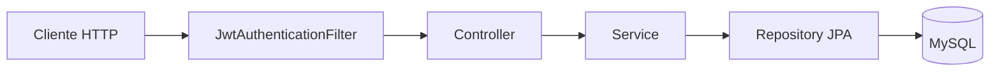

# EventNode API — Guía técnica detallada

Documentación del módulo **`eventnode-api`**: API REST para gestión de eventos académicos (inscripciones, asistencias, diplomas PDF por correo, usuarios y roles). Está pensada para quien mantenga el backend, integre un cliente (web/móvil) o despliegue en servidor.

---

## 1. Qué problema resuelve el sistema

| Necesidad | Cómo lo cubre la API |
|-----------|----------------------|
| Registrar estudiantes sin estar logueados | `POST /api/alumnos/registro` (público) |
| Iniciar sesión y obtener token | `POST /api/auth/login` → JWT + datos de perfil |
| Publicar y consultar eventos | CRUD bajo `/api/eventos` + listados con filtros |
| Que un alumno reserve cupo | Pre-check-in bajo `/api/precheckin` |
| Registrar asistencia el día del evento | `/api/asistencias` con ventana de tolerancia |
| Emitir diplomas por correo | JasperReports + SMTP en `/api/diplomas` |
| Administrar cuentas y roles | `/api/usuarios`, seed y categorías |

---

## 2. Stack tecnológico

| Componente | Versión / detalle |
|------------|-------------------|
| Lenguaje | Java **21** |
| Framework | Spring Boot **3.5.x** (`spring-boot-starter-parent`) |
| API web | `spring-boot-starter-web` (Tomcat embebido) |
| Persistencia | `spring-boot-starter-data-jpa` + **Hibernate** |
| Base de datos | **MySQL** (`mysql-connector-j`, runtime) |
| Seguridad | `spring-boot-starter-security` + **JWT** (JJWT 0.12.x) |
| Validación | `spring-boot-starter-validation` (Jakarta Bean Validation) |
| Correo | `spring-boot-starter-mail` (SMTP, p. ej. Gmail) |
| PDF diplomas | **JasperReports** 6.21.x |
| Build | Maven (`mvnw` / `mvnw.cmd`) |

Archivo de dependencias: `pom.xml`. Configuración por defecto: `src/main/resources/application.properties` (también puede existir `application-dev.properties`).

---

## 3. Arranque y entorno

### 3.1 Requisitos previos

1. **JDK 21** instalado (`java -version`).
2. **MySQL** accesible con la base y usuario definidos en `application.properties` (ejemplo en el repo: host `localhost`, puerto `3307`, base `event_node`).
3. Opcional: datos mínimos de roles y superadmin → `POST /api/seed/init` (solo entornos controlados).

### 3.2 Comandos útiles

```text
# Arrancar la API (Windows, desde la carpeta eventnode-api)
.\mvnw.cmd spring-boot:run

# Compilar sin tests
.\mvnw.cmd -q compile -DskipTests

# Tests (requieren MySQL si los tests levantan el contexto JPA completo)
.\mvnw.cmd test
```

Puerto HTTP por defecto: **8080** (`server.port`).

### 3.3 Configuración sensible

En `application.properties` suelen aparecer URL de BD, usuario/contraseña de aplicación y credenciales SMTP. **En producción** conviene:

- Sustituir valores por **variables de entorno** o un secret manager.
- Definir `app.jwt-secret` con una cadena larga y aleatoria (HMAC del JWT).
- No exponer `POST /api/seed/init` sin protección de red o deshabilitarlo.

Propiedades JWT (con valores por defecto en código si no se definen):

- `app.jwt-secret`
- `app.jwt-expiration-milliseconds` (por defecto del orden de **7 días** en `JwtTokenProvider`)

---

## 4. Arquitectura del backend

### 4.1 Capas (flujo típico de una petición)



1. **Filtro JWT**: si el header `Authorization: Bearer …` es válido, rellena el contexto de seguridad de Spring con el usuario cargado desde BD (`CustomUserDetailsService`).
2. **Controller**: traduce HTTP ↔ objetos Java; valida DTOs con `@Valid` donde aplica; devuelve `ResponseEntity` con código y cuerpo JSON (o bytes PDF en diplomas).
3. **Service**: reglas de negocio, transacciones (`@Transactional`), orquestación de varios repositorios o `EntityManager` para SQL nativo.
4. **Repository**: consultas Spring Data (`JpaRepository`, métodos derivados del nombre, `@Query` nativo donde hace falta).

### 4.2 Paquetes (`com.eventnode.eventnodeapi`)

| Paquete | Contenido típico |
|---------|------------------|
| `controllers` | `@RestController`, mapeo `@RequestMapping` / verbos HTTP |
| `services` | `@Service`, lógica de negocio |
| `repositories` | Interfaces `JpaRepository<Entidad, Id>` |
| `models` | Entidades `@Entity` ↔ tablas |
| `dtos` | Request/response y validaciones |
| `config` | `SecurityConfig` y futuras configuraciones |
| `security` | JWT, filtro, `UserDetailsService` |
| `schedulers` | `@Scheduled` (estados de eventos) |

En el código hay **JavaDoc en español** (clases, métodos públicos y comentarios inline en flujos complejos). Para HTML: `mvn -DskipTests javadoc:javadoc` → salida bajo `target/site/apidocs/`.

---

## 5. Modelo de dominio y datos

### 5.1 Roles (`roles`)

Valores usados en lógica y seguridad: **`ALUMNO`**, **`ADMINISTRADOR`**, **`SUPERADMIN`**.

En Spring Security las autoridades se exponen como **`ROLE_ALUMNO`**, **`ROLE_ADMINISTRADOR`**, **`ROLE_SUPERADMIN`** (`SimpleGrantedAuthority`). Las reglas `hasRole("ALUMNO")` del DSL equivalen a comprobar `ROLE_ALUMNO`.

### 5.2 Usuario (`usuarios`)

- Identificador de login: **correo** (único).
- **Contraseña**: en condiciones normales **BCrypt** (cadena que empieza por `$2…`). El login admite legado en **texto plano** y, si coincide, **re-hashea** a BCrypt al autenticar.
- **Estado**: `ACTIVO` / `INACTIVO` — afecta si Spring considera la cuenta habilitada.
- **Bloqueo**: tras varios fallos de contraseña se guarda `bloqueado_hasta`; mientras sea futuro, la cuenta se trata como bloqueada.
- **Recuperación**: campo `recover_password` guarda un **código de 6 dígitos** temporal (no es hash).

### 5.3 Evento (`eventos`)

**Estados del ciclo de vida:**

| Estado | Significado |
|--------|-------------|
| `PRÓXIMO` | Creado o reactivado; aún no ha empezado la hora de inicio |
| `ACTIVO` | Ya comenzó el periodo del evento (lo pone `EventoScheduler` al llegar `fechaInicio`) |
| `FINALIZADO` | Pasó `fechaFin` (scheduler) |
| `CANCELADO` | Cancelado por administración |

El **scheduler** (`EventoScheduler`, cada **60 s**) recorre eventos y actualiza `PRÓXIMO`→`ACTIVO` y `ACTIVO`→`FINALIZADO` según la hora del servidor.

Campos de negocio importantes:

- **`capacidadMaxima`**: tope de pre-check-ins **ACTIVO** simultáneos.
- **`tiempoCancelacionHoras`**: hasta cuántas horas antes de `fechaInicio` el alumno puede cancelar inscripción.
- **`tiempoToleranciaMinutos`**: ventana simétrica alrededor de `fechaInicio` para permitir registrar **asistencia**.

### 5.4 Pre-check-in (`pre_checkin`)

Estados de la **inscripción**: `ACTIVO`, `CANCELADO`. Solo las filas `ACTIVO` cuentan para cupo.

Reglas resumidas (ver `PreCheckinService`):

- Solo usuarios que existan como **alumno** pueden inscribirse.
- El evento debe estar `PRÓXIMO` o `ACTIVO` y **no** haber pasado ya `fechaInicio`.
- Si existe fila previa `CANCELADO`, puede **reactivarse** a `ACTIVO`.

### 5.5 Asistencia (`asistencias`)

- Requiere pre-check-in **ACTIVO** para ese usuario y evento.
- El evento debe estar en estado **`ACTIVO`** (coherente con el scheduler).
- No puede haber dos asistencias para el mismo par usuario–evento.
- La hora actual debe caer en `[fechaInicio − tolerancia, fechaInicio + tolerancia]`.
- Estados de la fila de asistencia: típicamente **`PENDIENTE`** / **`ASISTIDO`** (validación por staff con `PATCH`).

### 5.6 Diplomas

- Tabla de configuración por evento (plantilla JRXML en **Base64**, firma imagen, etc.).
- Tabla de **emisiones** (`diplomas_emitidos`): qué usuario recibió intento de envío y si fue `ENVIADO` o `ERROR`.

Relación **evento ↔ organizador** es **N:M** mediante tabla puente `evento_organizador`; parte del código usa **`EntityManager.createNativeQuery`** porque no hay entidad JPA dedicada a la fila puente.

---

## 6. Autenticación y seguridad HTTP

### 6.1 Uso del JWT en el cliente

1. `POST /api/auth/login` con JSON `{ "correo", "password" }`.
2. Respuesta incluye el campo **`token`**.
3. En el resto de peticiones protegidas:  
   `Authorization: Bearer <token>`

El **subject** del JWT es el **correo** del usuario; el filtro vuelve a cargar usuario y roles desde BD en cada petición.

### 6.2 Matriz de autorización (resumen fiel a `SecurityConfig`)

**Sin token (`permitAll`):**

- Toda la rama `POST/GET/...` bajo **`/api/auth/**`**
- **`POST /api/alumnos/registro`**
- **`POST /api/seed/init`**
- **`GET /api/categorias`**
- **Todas las peticiones `GET` bajo `/api/eventos/**`** (listados, detalle, subrutas GET de organizadores/categorías embebidas en ese prefijo)

**Con token y rol:**

| Condición | Rutas (ejemplos) |
|-----------|------------------|
| `ADMINISTRADOR` o `SUPERADMIN` | `POST/PUT/DELETE` `/api/categorias/**`; `POST` crear evento; `PUT/DELETE` `/api/eventos/**`; `POST` cancelar/reactivar evento; `PATCH` `/api/asistencias/*/estado`; rutas **`/api/precheckin/evento/**`** (listados admin de inscritos, conteos, etc.) |
| Solo `ALUMNO` | `POST` `/api/precheckin/inscribirse`, `cancelar`; `GET` `/api/precheckin/usuario/**` |
| Cualquier usuario **autenticado** | `GET/PUT` `/api/usuarios/{id}/perfil` |
| `ADMINISTRADOR` o `SUPERADMIN` | `GET /api/usuarios`, `POST /api/usuarios/admin` |

**Todo lo demás** cae en **`anyRequest().authenticated()`**: hace falta JWT válido. Eso incluye, entre otras:

- `PUT /api/alumnos/{id}` (actualización de alumno)
- `POST` registrar asistencia, `GET` listados de asistencias, diplomas, etc.

> **Importante:** que una ruta sea `authenticated()` no implica que el `id` del recurso sea “del mismo usuario”; conviene reforzar autorización en servicio o controlador si se expone información sensible entre usuarios.

### 6.3 CORS

Orígenes permitidos (desarrollo): `http://localhost:5173`, `5174`, `3000`. Métodos: GET, POST, PUT, DELETE, PATCH, OPTIONS. `allowCredentials(true)` con orígenes explícitos (no `*`).

---

## 7. Referencia de API (detalle por módulo)

Convenciones comunes:

- Muchas respuestas de error JSON: `{ "mensaje": "..." }`.
- Fechas/horas de eventos suelen ser **ISO-8601** en JSON (ver `@JsonFormat` en DTOs como `EventoCreateRequest`).

### 7.1 `POST /api/auth/login`

- **Body:** `LoginRequest` — `correo` (email), `password`.
- **200:** `LoginResponse` — mensaje, rol, ids, nombres, correo, datos de alumno si aplica, **`token`**.
- **401:** credenciales incorrectas.
- **403:** cuenta inactiva o bloqueada temporalmente.

### 7.2 Recuperación de contraseña (`/api/auth/recuperar/...`)

| Paso | Método y ruta | Body (JSON) | Notas |
|------|---------------|---------------|--------|
| Enviar código | `POST .../enviar-codigo` | `{ "correo" }` | Guarda código en usuario; envía correo HTML |
| Verificar | `POST .../verificar-codigo` | `{ "correo", "codigo" }` | Solo comprueba coincidencia |
| Restablecer | `POST .../restablecer` | `{ "correo", "codigo", "nuevaPassword" }` | BCrypt + limpia código |

### 7.3 Alumnos `/api/alumnos`

| Método | Ruta | Auth | Descripción |
|--------|------|------|-------------|
| POST | `/registro` | No | Alta usuario rol ALUMNO + fila alumno |
| PUT | `/{id}` | JWT (cualquier autenticado según configuración actual) | Actualiza datos; validar en negocio si debe ser solo el dueño |

### 7.4 Usuarios `/api/usuarios`

| Método | Ruta | Rol típico | Descripción |
|--------|------|------------|-------------|
| GET | `/` | Admin | Lista perfiles (puede ser costosa: N llamadas internas) |
| GET | `/{id}/perfil` | Autenticado | Perfil unificado |
| PUT | `/{id}/perfil` | Autenticado | Actualización parcial por mapa |
| POST | `/admin` | Admin | Crea administrador (no SUPERADMIN por esta vía) |
| PATCH | `/{id}/estado` | (según cómo quede expuesto tras `anyRequest`) | Toggle ACTIVO/INACTIVO |

### 7.5 Eventos `/api/eventos`

Incluye **subrutas** de catálogo bajo el mismo prefijo (duplicado conceptual con `/api/categorias` en lectura simple):

| Área | Métodos | Notas |
|------|---------|--------|
| CRUD evento | `POST /crear`, `GET /`, `GET /{id}`, `PUT /{id}`, `DELETE /{id}`, `POST /{id}/cancelar` | `GET /**` público; mutaciones admin |
| Filtros en listado | Query: `nombre`, `mes`, `categoriaId`, `estado` | Criteria dinámico en servicio |
| Organizadores | `GET/POST/PUT/DELETE .../organizadores` | CRUD + búsqueda por nombre |
| Categorías (lista simple) | `GET /categorias` | id + nombre |

### 7.6 Categorías `/api/categorias`

CRUD administrado por `CategoriaService`: nombres en **MAYÚSCULAS**; no se puede borrar si hay eventos asociados.

### 7.7 Pre-check-in `/api/precheckin`

| Ruta | Uso |
|------|-----|
| `POST /inscribirse`, `POST /cancelar` | Cuerpo con `idUsuario`, `idEvento` (enteros) |
| `GET /evento/{idEvento}` | Staff: inscritos ACTIVO |
| `GET /usuario/{idUsuario}` | Alumno: sus eventos inscritos |
| `GET /evento/{idEvento}/count` | Conteo ACTIVO |

### 7.8 Asistencias `/api/asistencias`

| Ruta | Descripción |
|------|-------------|
| `POST /registrar` | Body: `idUsuario`, `idEvento`, `metodo` — ojo: JSON puede mandar números como `Double` |
| `POST /manual` | `matricula`, `idEvento`; `metodo` opcional (default MANUAL) |
| `GET /evento/{idEvento}` | Lista con datos de usuario |
| `PATCH /{idAsistencia}/estado` | Body `{ "estado": "PENDIENTE" \| "ASISTIDO" }` — admin |
| `GET /evento/{idEvento}/count` | Total de filas de asistencia |

### 7.9 Diplomas `/api/diplomas`

- Cuerpos con **Base64 largos** (plantilla JRXML, imágenes); revisar límites `multipart` / Tomcat en `application.properties`.
- Algunas respuestas son **binario PDF** (`Content-Type: application/pdf`), no JSON.
- Endpoints principales: crear, listar, obtener detalle, emitir masivo, actualizar, eliminar, preview, descarga por usuario, listado por estudiante.

### 7.10 Seed `/api/seed/init`

Crea roles si faltan y usuario **`admin@eventnode.com`** (o renueva password BCrypt). **No usar en producción** sin aislar.

---

## 8. Servicios (mapa mental)

| Servicio | Responsabilidad principal |
|----------|---------------------------|
| `AuthService` | Login, bloqueo por intentos, migración BCrypt, emisión JWT, datos extra alumno |
| `PasswordRecoveryService` | Código por correo y restablecimiento |
| `AlumnoService` | Registro y actualización alumno/usuario |
| `UsuarioService` | Perfiles, alta admin, estado, actualización nombre/apellidos |
| `EventoService` | CRUD evento, criterios de búsqueda, SQL nativo en borrado y puente organizadores |
| `PreCheckinService` | Inscripción, cancelación, listados |
| `AsistenciaService` | Check-in con reglas de tiempo y duplicados |
| `DiplomaService` | Jasper compile/fill/export, SMTP, emisiones |
| `CategoriaService` | CRUD categorías y conteo de eventos |

---

## 9. Tests

- Ubicación: `src/test/java/com/eventnode/eventnodeapi/...`
- **Integración / WebMvc**: muchos `*ControllerTest` arrancan contexto Spring y **necesitan MySQL** si JPA intenta conectar (error típico: *Communications link failure*).
- **Unitarios con Mockito**: `*ServiceTest` sin levantar BD completa, según configuración de cada clase.
- **DTOs**: validación con `DtoValidatorHolder` (validador Jakarta sin Spring).
- **Smoke:** `EventnodeApiApplicationTests#contextLoads`.

Para CI robusto: perfil `test` + **H2** o **Testcontainers** MySQL, y `application-test.properties` que no apunte a la BD de desarrollo.

---

## 10. Problemas frecuentes y diagnóstico

| Síntoma | Causa probable |
|---------|----------------|
| `403 Forbidden` en rutas de alumno | Token sin rol `ROLE_ALUMNO` o usuario INACTIVO |
| `403` al crear evento | Usuario no es ADMINISTRADOR/SUPERADMIN |
| Asistencia “evento no activo” | Scheduler aún no pasó el evento a `ACTIVO` o fecha/estado inconsistente |
| Tests masivos en error JDBC | MySQL no arrancado o URL/puerto incorrectos |
| Diploma / banner muy grande | Aumentar `spring.servlet.multipart.max-request-size` y límites Tomcat |
| CORS bloqueado | Origen del front no está en la lista de `SecurityConfig` |

---

## 11. Glosario ampliado

| Término | Explicación breve |
|---------|-------------------|
| **JWT** | JSON Web Token firmado; aquí lleva el correo como subject y expiración configurable. |
| **Stateless** | Sin sesión HTTP; cada petición autenticada aporta el token. |
| **DTO** | Clase solo para transferir datos en la API; separa contrato HTTP de entidades JPA. |
| **`IllegalArgumentException`** | Argumentos o datos inválidos (típico → HTTP 400). |
| **`IllegalStateException`** | Operación no permitida en el estado actual del dominio (400 o 409). |
| **`Specification` / Criteria API** | Consultas JPA dinámicas en `EventoRepository.findAll(spec)` |
| **JRXML / Jasper** | Definición de informe; se compila a `.jasper` en memoria y se rellena con parámetros. |
| **`@Transactional`** | Delimita transacción de base de datos (commit/rollback). |

---

## 12. Referencias de código

Archivos clave para profundizar (además de los JavaDoc en el IDE):

- Seguridad: `config/SecurityConfig.java`, `security/JwtAuthenticationFilter.java`, `security/JwtTokenProvider.java`, `security/CustomUserDetailsService.java`
- Negocio central: `services/EventoService.java`, `services/PreCheckinService.java`, `services/AsistenciaService.java`, `services/DiplomaService.java`
- Tareas: `schedulers/EventoScheduler.java`
- API HTTP: `controllers/*.java`

---

*Última ampliación de esta guía: documentación orientada a integración, despliegue y mantenimiento. Para el contrato exacto de cada campo JSON, revisar las clases en `dtos/` y las anotaciones de validación.*
